# Automatizando publicação do OwnCloud com AWS e Terraform

<ol>
<li>Criar conta na AWS</li>
</img>

Preencha suas informações e escolha o tipo de conta que preferir

</img>

Instale o CLI da AWS e faça uso do IAM na sua conta que você criou acima

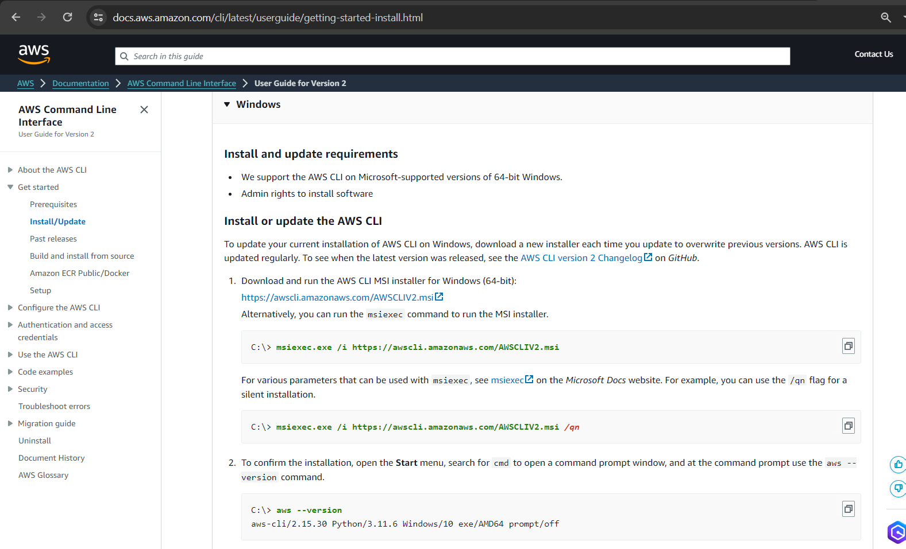</img>

O IAM (Identity and Access Management) é uma forma de controlar seu acesso de forma granular, nós acessamos a página do IAM no console da AWS.

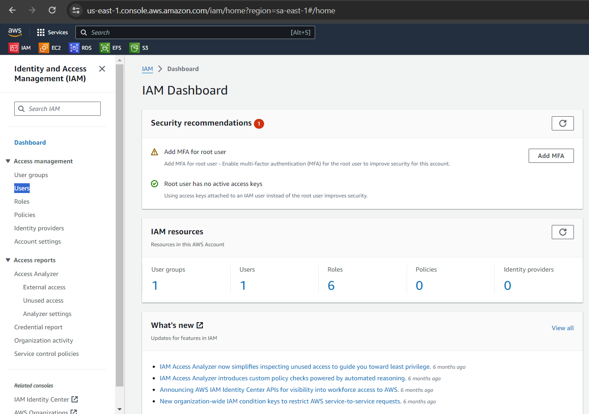</img>

Vamos em Users para criar um novo usuario que o Terraform terá acesso

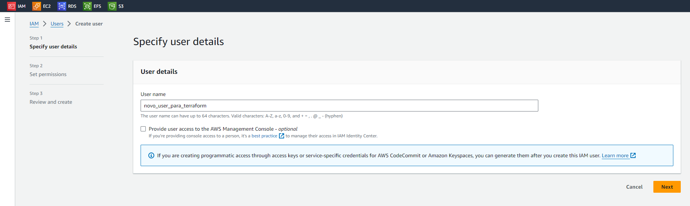</img>

A discussão sobre grupos de acesso e políticas de acesso é extremamente complexa e longa, vamos nos ater a criar um novo grupo dando acesso apenas aos recursos EC2 fundamentais como mostra a imagem 

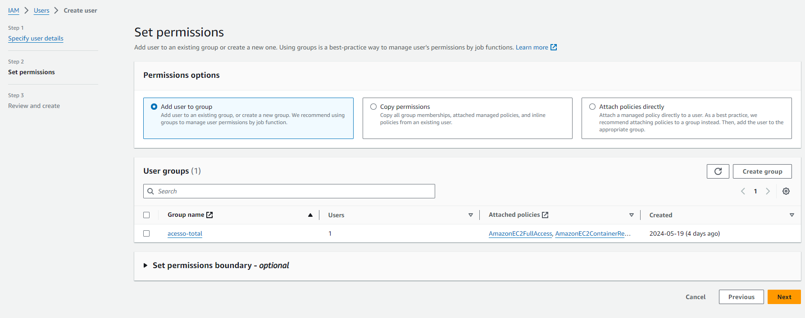</img>
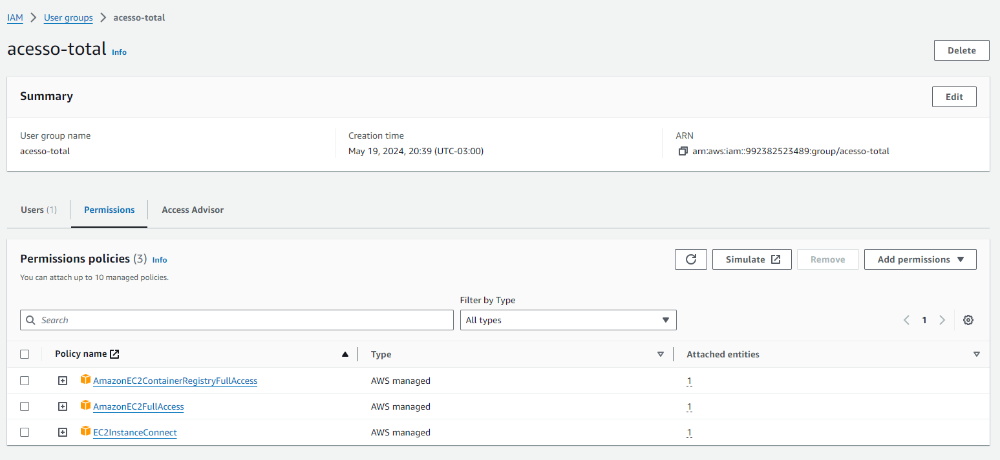</img>

Uma vez criado o usuario IAM, atribua uma chave para ele, e com essa chave que vamos acessar via CLI a AWS. Clicando no nome do user criado você verá o sumário e abas abaixo sendo uma delas Security Credentials

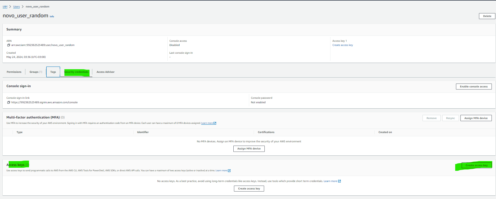</img>

Na tela de criar a cahve escolha o Use Case para CLI, dê uma descrição e baixe o arquivo csv com os dados Access key,
Secret access key

Abra um terminal e digite <code>aws configure</code> preencha corretamente com a regiao de acesso que você quer dar para esse user bem como a chave e secret. Pronto você configurou o acesso da sua CLI AWS.

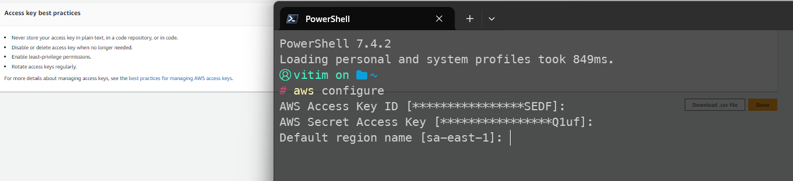</img>
<li>Baixar e Instalar o Terraform</li>
</img>

Escolha a versão correta para seu O.S, no meu caso Win32

</img>

Após extrair o executável. Adicione ao Path

</img>

Use a extensão oficial do Terraform no VSCode.

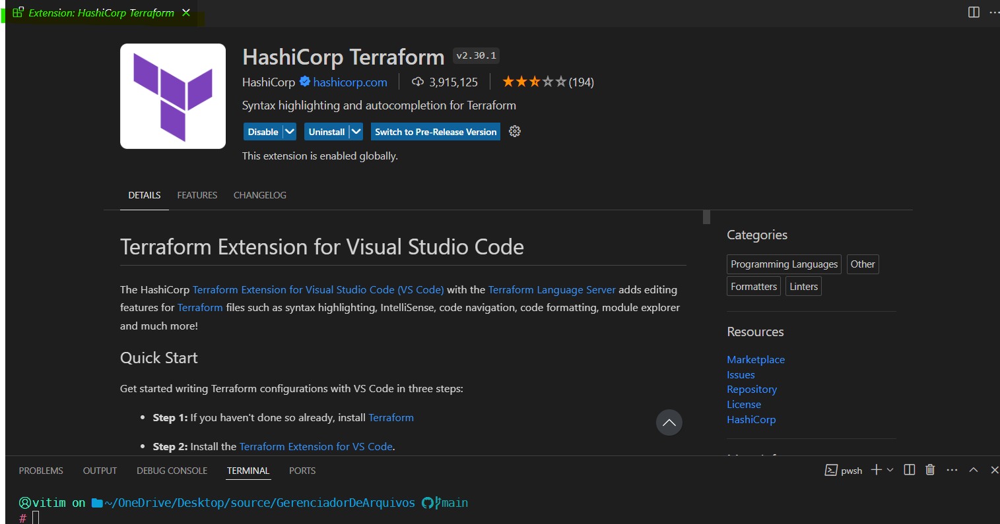</img>
<li>Crie a Infraestrutura como Código em uma pasta</li>
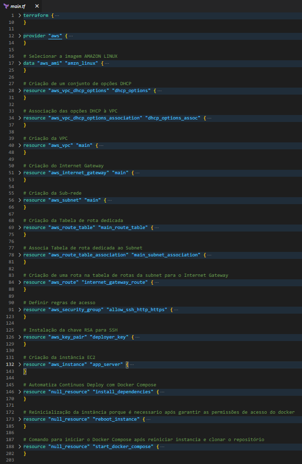</img>
<i>o código acima criado por JVCSS é público no <a href="https://github.com/jvcss/OwnCloudAWSTerraformIAC">Repositório</a></i> 
<b>deixe sua estrela!</b>

Nessa Infraestrutura de Instância EC2 estamos criando uma EC2 na região SP do brasil, especificamente definindo uma zona para ter acesso ao DNS gerado automaticamente.

Estamos permitindo acesso irrestrito via SSH uma prática não recomendada! O motivo é para facilitar acesso remoto via diferentes máquinas.

Estamos configurando a Networking para dar acesso a internet para essa instância. bem como permitir acesso entre instâncias na mesma VPC

Por fim, estamos automatizando a entrega do SaaS com o docker com o orquestrador compose. 

Usamos o NGINX como framework de controle proxy porque ele permite granularidade na entrega bem como controles finos como cache e filtros contra ataques de injeção de conteúdo arbitrário ou DDOS.

O SaaS OwnCloud depende do MariaDB e do Redis, por isso criamos também as instancias locais desses serviços (note que em uma aplicação real esses serviços são na verdade separados do EC2 com os nomes de RDS[Relational Database Service] e ElastiCache na AWS respectivamente)

Um detalhe importante é como nós elegantemente controlamos a quantidade de memória RAM e CPU permitida para o SaaS via orquestrador docker-compose

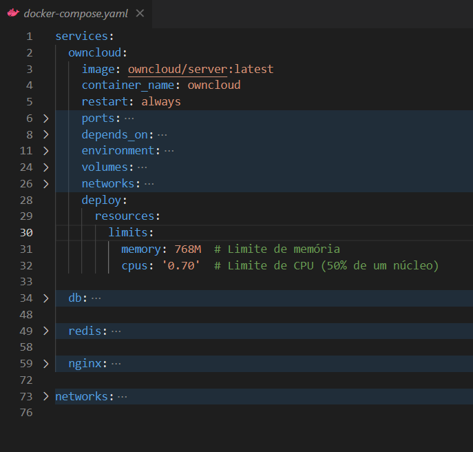</img>

Porque via teste notamos que o uso de recursos desse SaaS superou e muito o limite da nossa Instância com os limites gratuitos, inutilizando-a.

A finalização então está na entrega ao público via NGINX com seu arquivo de configuração, nessa versão simplificada permitimos apenas conexão HTTP. Já que um certificado auto-assinado não tem valor comercial não foi aplicado nesse exemplo.

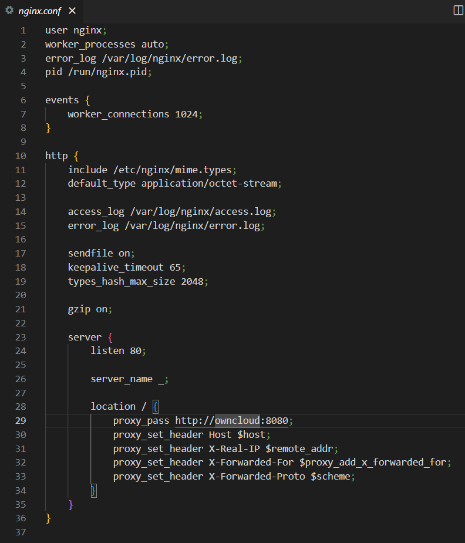</img>
<i>Nesse arquivo nginx.conf estamos usando o Framework como proxy como mostra a primeira linha do arquivo.</i>

As definições nesse arquivo estão em resumo definindo limites, como quantidade de nós criados, tempo de validade de cache, tipos de conexão aceita, tipos de arquivo, tamanho de encriptação, local onde salvar logs de acesso, encaminhamento de cabeçalho e o mais importante o URI do serviço a ser encaminhado que nesse caso com o docker é o nome do container definido no arquivo docker-compose.yaml

Então após definir todo nosso ambiente, realizar as devidas automações como substuição das constantes OWNCLOUD_DOMAIN e OWNCLOUD_TRUSTED_DOMAINS para o IP Publico e DNS publico dessa Instância via arquivo Terraform.

Nós podemos apenas com simples comandos <code>terraform init</code>  <code>terraform validade</code> <code>terraform plan -out planoNovo</code> concluir a configuração dessa Infraestrutura e enviar para a AWS com <code>terraform apply "planoNovo"</code>

Finalmente após toda essa configuração podemos garantir que criamos o ambiente IaC consistente.

Acesse seu OwnCloud via DNS: lembre-se de tirar o S do HTTP, o chrome automaticamente troca o protocolo mas você pode acessar manualmente apenas apagando o S. Em alguns casos é necessário acessar seu site HTTP via Aba Anônina.

Segue o print da publicação onde: Criamos uma EC2 nova, clonamos o repositório e ligamos os serviços.

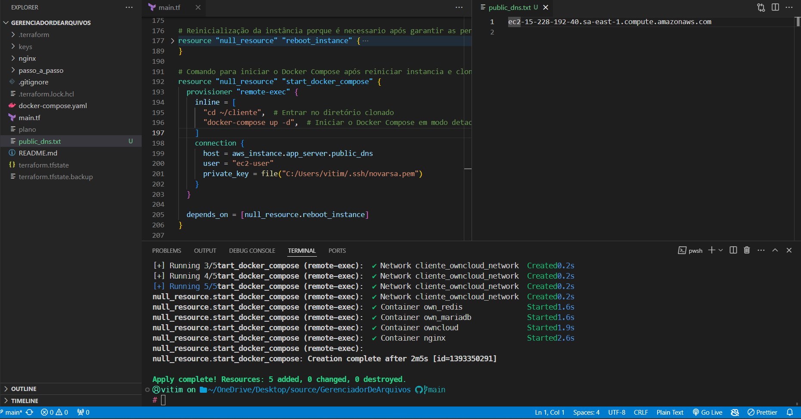</img>
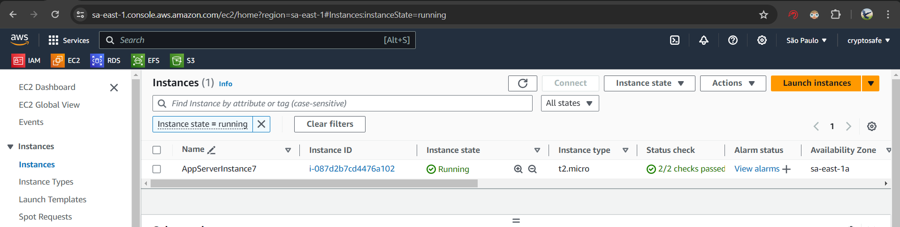</img>
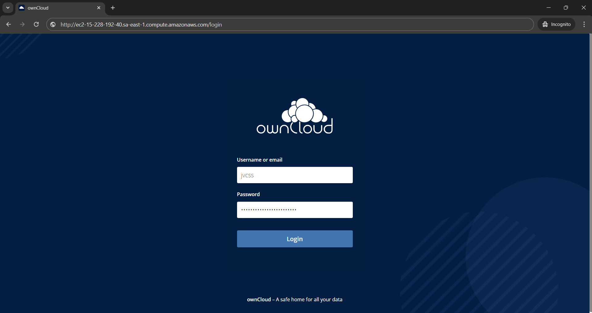</img>
<i>user: vide Container OwnCloud no Docker-Compose<i>
<i>senha: vide Container OwnCloud no Docker-Compose<i>
</ol>
