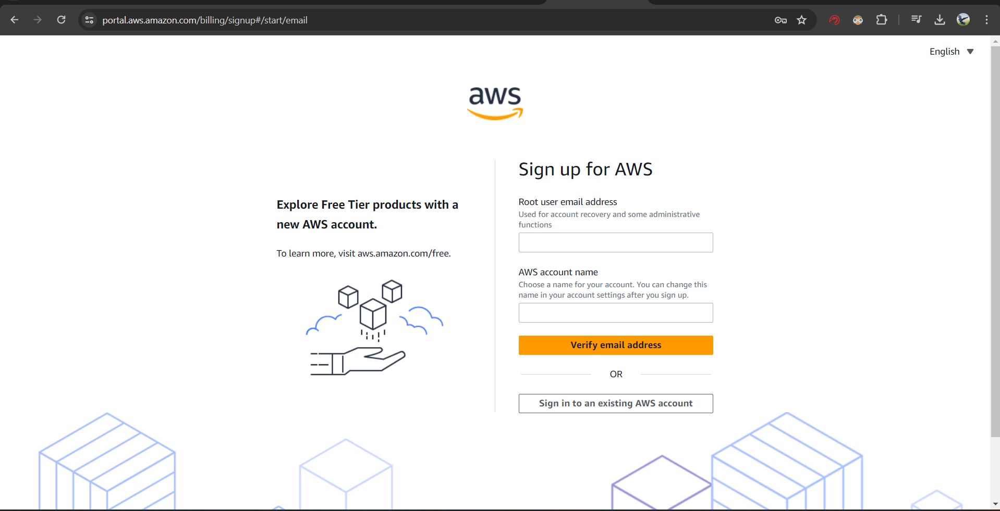
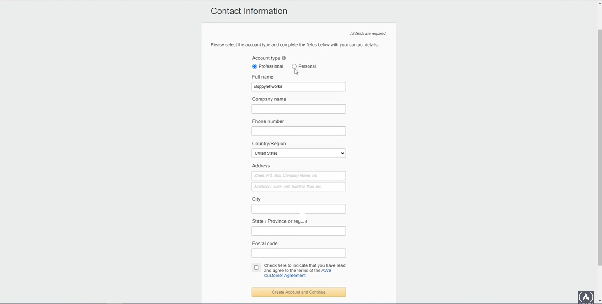
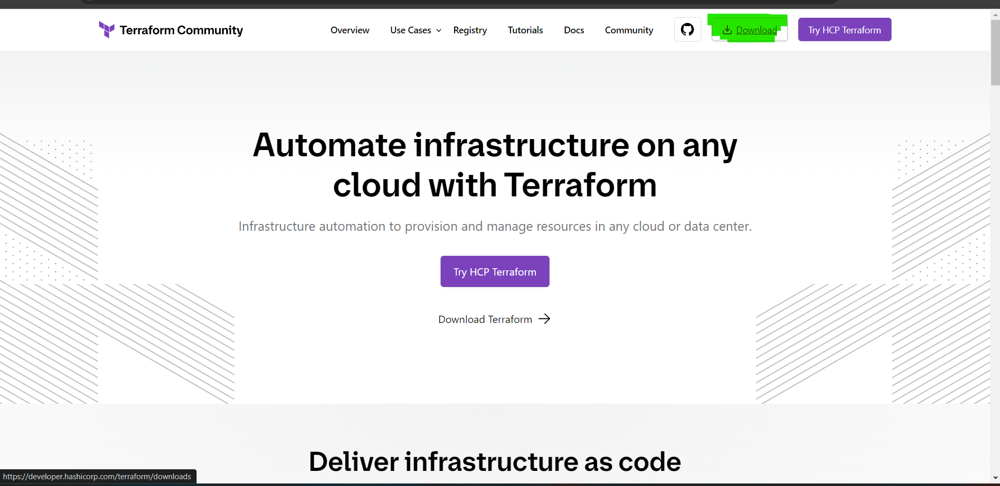
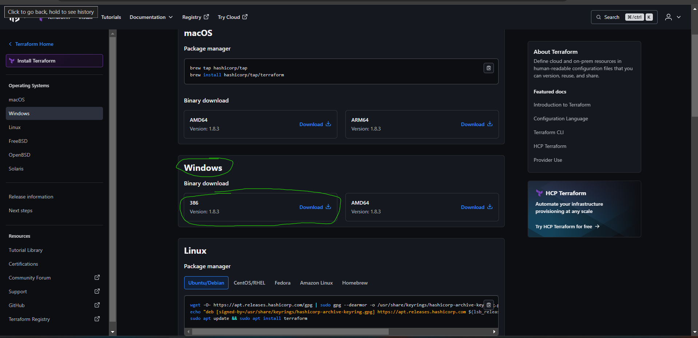
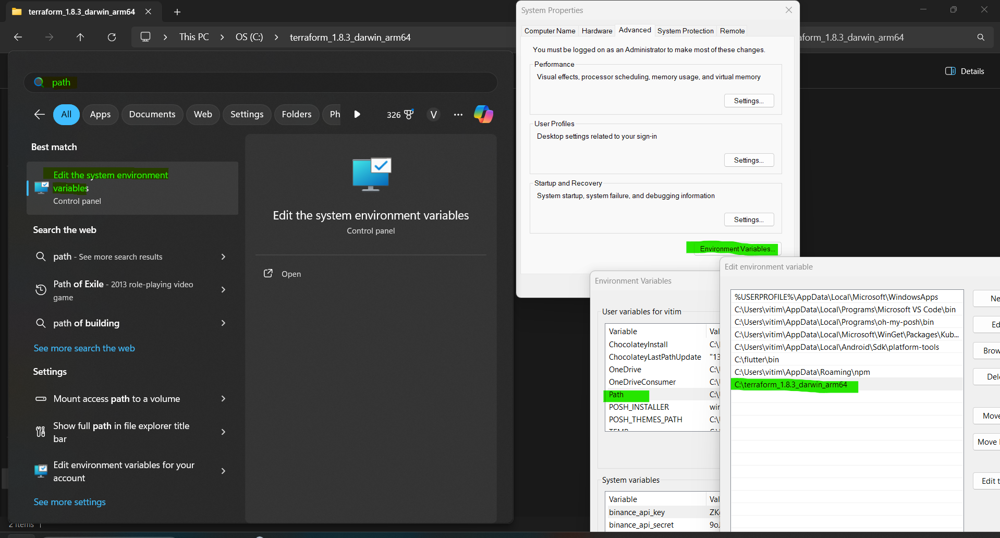

# Automatizando publicação do OwnCloud com AWS e Terraform

<ol>
<li>Criar conta na AWS</li>
</img>

Preencha suas informações e escolha o tipo de conta que preferir

</img>
<li>Baixar o Terraform</li>
</img>

Escolha a versão correta para seu O.S, no meu caso Win32

</img>

Após extrair o executável. Adicione ao Path

</img>
</ol>